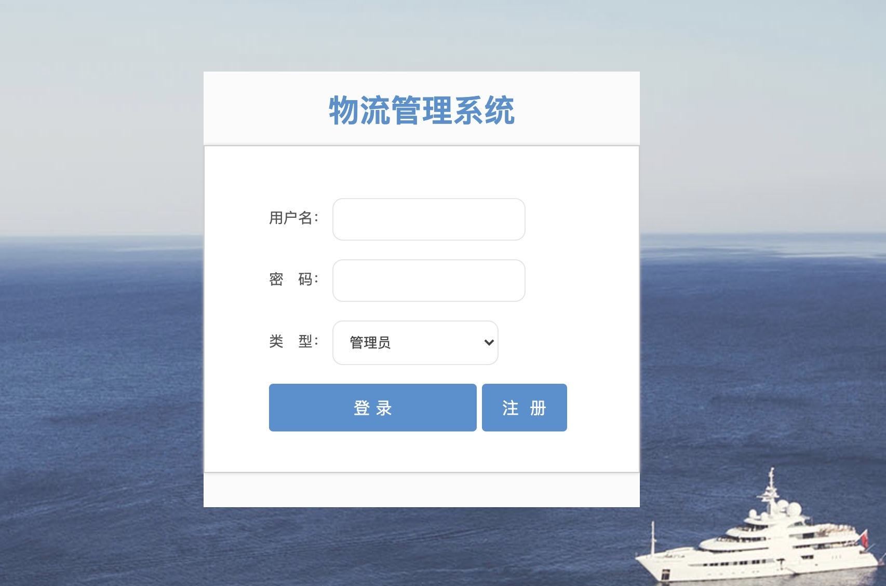
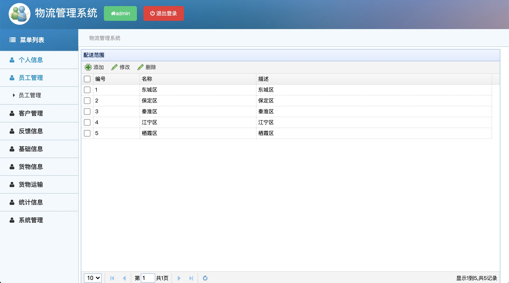
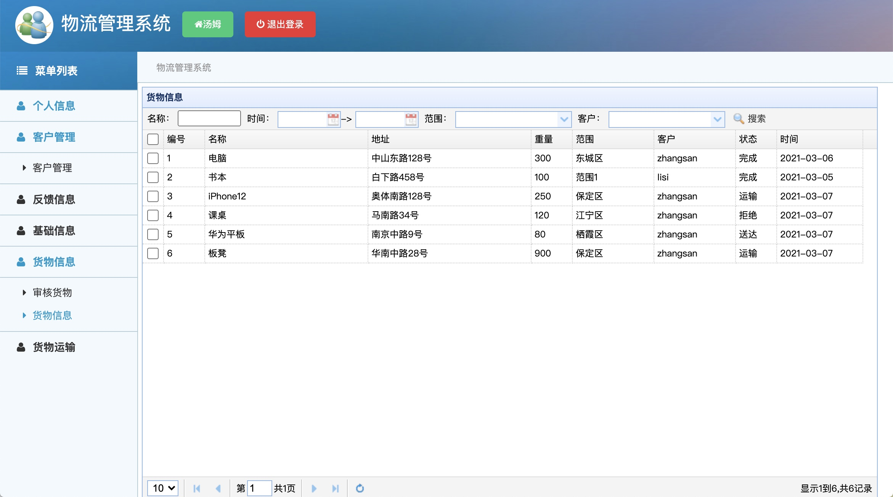
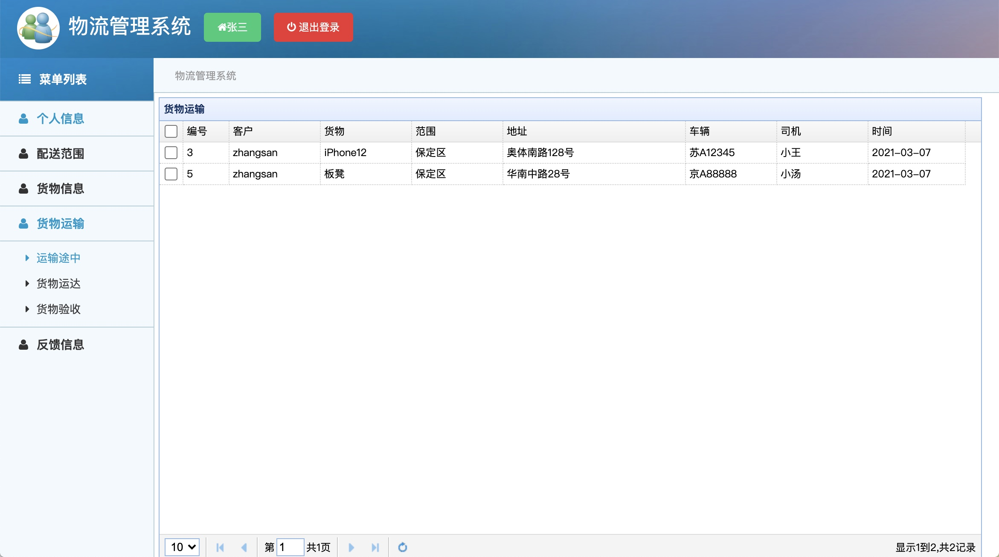

## 一、项目简介

​	物流管理系统，基于SSM实现的物流管理系统

## 二、技术实现

​	后台框架：Spring、SpringMVC、MyBatis

​    UI界面：JSP、jQuery、EasyUI

​	数据库：MySQL

## 三、系统功能

​	系统主要分为三种用户角色，分别是管理员、员工以及客户，其具体功能如下：

1. 管理员

    个人信息、员工管理、客户管理、反馈信息、基础信息、货物信息、货物运输、统计信息、系统管理

2. 员工

    个人信息、客户管理、反馈信息、基础信息、货物信息、货物运输

3. 客户

    个人信息、配送范围、货物信息、货物运输、反馈信息

1）系统登陆界面

2）管理员界面

3）员工界面

4）客户界面

## 四、环境搭建

​	运行环境：

- JDK 8
- Eclipse
- Tomcat 7
- MySQL 5.7

### 1. 安装JDK

​	安装文件：

​	安装步骤：

1. 双击`jdk-8u171-windows-x64.exe`安装JDK
2. 出现提示时点击"下一步"即可

### 2. 安装Eclipse

​	安装文件：

​	安装步骤：

1. 右击`eclipse-jee-luna-SR2-win32-x86_64.zip`解压到当前文件夹

2. 双击解压目录下的`eclipse.exe`

### 3. 安装Tomcat

​	安装文件：

​	安装步骤：

1. 右击`apache-tomcat-7.0.93.zip`解压到当前文件夹

2. 将Tomcat关联到Eclipse中

### 4. 安装MySQL

​	安装文件：

- MySQL服务器 
- MySQL客户端 

​    安装步骤：

1. 双击`phpstudy_x64_8.1.1.3.exe`安装MySQL服务器
2. 双击` Navicat_Premium_11.0.8.exe  `安装MySQL客户端
3. 使用Navicat连接MySQL服务器

## 五、部署项目

​	步骤：

1. 导入数据库脚本
2. 导入项目代码
3. 部署运行项目

## 六、项目演示

   访问地址：http://localhost:8080/cgwuliuxinxissm/

- 管理员，用户名：admin	密码：admin
- 员工，用户名：tom密码：123
- 客户，用户名：zhangsan密码：123

## 七、补充说明

​	**1.在完成毕业设计或项目学习过程中，如有问题可以加QQ交流群，群号470098064**

​	**2.如需毕设论文或远程技术支持服务，可以联系群管理员，额外提供相关服务（第三方提供，另收费）**

​	**3.更多的毕设项目课程，可以访问以下链接**

- CSDN学院 [https://edu.csdn.net/lecturer/2104](https://edu.csdn.net/lecturer/2104)
- 51CTO学院 https://edu.51cto.com/sd/9a4cc
- 腾讯课堂 [https://tangyang.ke.qq.com/](https://tangyang.ke.qq.com/)

